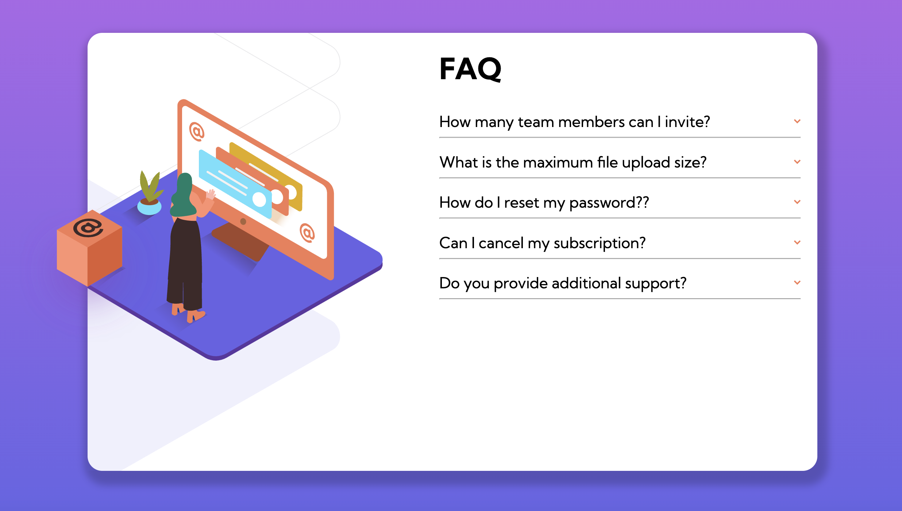

# FAQ Accordion Card

Welcome to the FAQ Accordion Card project! This project was created as part of the Frontend Mentor challenge and served as an early learning experience. It showcases the use of CSS checkbox trick to show and hide the questions and answers in an accordion-style layout. Not using JavaScript is the main feature of this project, making it a unique challenge.

## Challenge Details

This project is based on the [Frontend Mentor Accordion Challenge](https://www.frontendmentor.io/challenges/faq-accordion-card-XlyjD0Oam). The goal was to create an accordion component without using JavaScript, solely relying on CSS and the checkbox trick for interactivity.

## Note

Please note that this project was created during my early days of learning web development. While it demonstrates the desired functionality, it may not be the most efficient implementation. The focus of this project was to explore the CSS checkbox trick and create a mobile-responsive design. Future iterations of this project may incorporate JavaScript for enhanced interactivity and improved efficiency.

## Technologies Used

- HTML
- CSS

## Getting Started

To view the Accordion Frontend locally, follow these steps:

1. Clone the repository: `git clone https://github.com/pradeepkhanal23/frontend-mentor-accordian-challenge.git`
2. Navigate to the project directory: `cd frontend-mentor-accordian-challenge`
3. Open the `index.html` file in your preferred web browser.

## Features

- Accordion-style layout for displaying frequently asked questions and their corresponding answers.
- Use of the CSS checkbox trick for toggling the visibility of the answers.
- Mobile-responsive design to ensure a satisfactory experience across different devices.

## Customization

If you wish to customize the styles or content of the Accordion Frontend, you can modify the following files:

- `styles.css`: Contains the CSS styles for the accordion component.
- `index.html`: Contains the HTML structure and content for the accordion.

Feel free to explore and experiment with these files to match your requirements.

## License

This project is licensed under the [MIT License](LICENSE).

## Contact

If you have any questions or suggestions, feel free to reach out to the project maintainer:

Frontend Mentor https://www.frontendmentor.io
